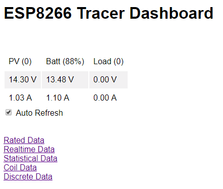
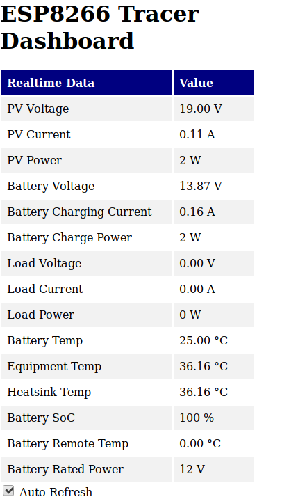
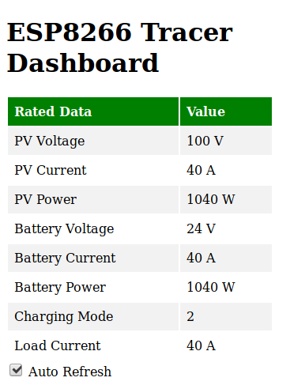
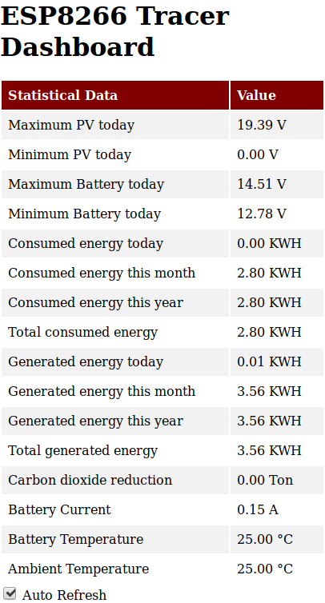
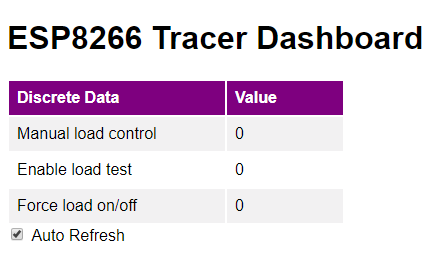
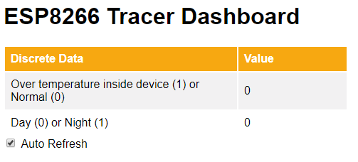

## ESP8266 Tracer Webserver

A simple webserver to create a web dashboard for the Tracer series charge controllers.

You can see the JSON data responses if you naviate to any of the following URLs:

```
  /getRatedData
  /getRealtimeData
  /getRealtimeStatus
  /getStatisticalData
  /getDiscrete
  /getCoils
```

## Screenshots

### Dashboard overview page


### Realtime Data page


### Rated Data page


### Statistical Data page


### Coil Data page


### Discrete Data page

